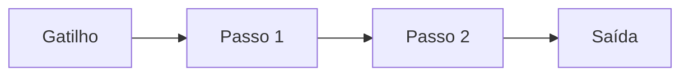

# Workflow – {{title}}

## Propósito
> O que este workflow accomplish de ponta a ponta?

## Gatilho
> Como isso começa? (cron, webhook, slash command, manual, mudança de arquivo)

## Passos

### Passo 1: [Nome]
- **Ferramenta/Ação:** 
- **Entrada:** 
- **Saída:** 

### Passo 2: [Nome]
- **Ferramenta/Ação:** 
- **Entrada:** 
- **Saída:** 

### Passo 3: [Nome]
- **Ferramenta/Ação:** 
- **Entrada:** 
- **Saída:** 

## Tratamento de Erros
| Ponto de Falha | Recuperação |
|----------------|-------------|
| | |

## Relacionado
- Agent – 
- Skill – 
